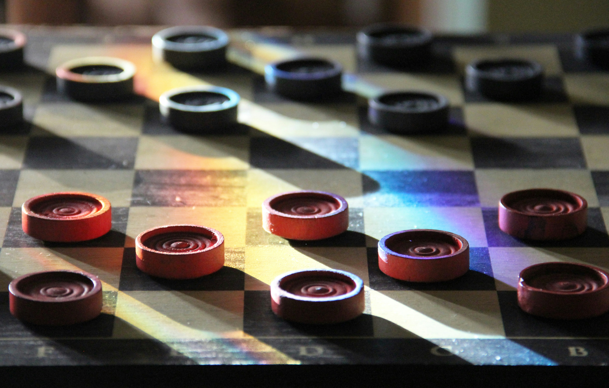

:::div{class="full-bleed"}

:::
 

TThe Chess & Math module is a combination of logic, strategic thinking, and playfulness.

Participants can develop their problem-solving skills through **various board games and exciting mathematical puzzles**.

The module includes classic board games such as checkers, Nine Men’s Morris, Go, and tic-tac-toe, giving players a wide range of logical challenges and helping them improve their **concentration, strategic mindset, and creativity**.

This module is ideal for those who want to sharpen their thinking in an engaging and playful way.